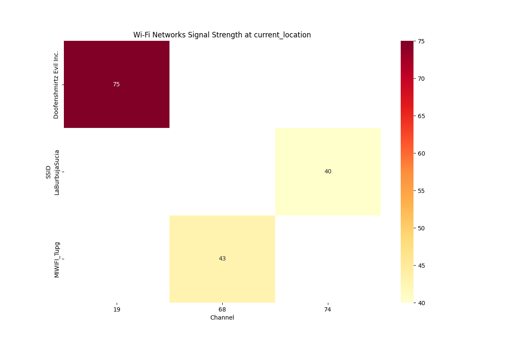

# WiFi Network Scanner and Analyzer

A Python-based tool for scanning, analyzing, and visualizing WiFi networks in your vicinity. This tool provides insights into network signal strengths and channel distributions through intuitive visualizations.

## Features

- 🔍 Scans for nearby WiFi networks
- 📊 Creates heatmap visualizations of network signal strengths
- 📈 Generates CSV reports with network data
- 🖥️ Cross-platform support (Windows/Linux/MacOS)
- 🕒 Timestamp tracking for each scan
- 📱 Simple command-line interface

## Requirements

- Python 3.x
- Required Python packages:
  - pandas
  - matplotlib
  - seaborn
  - numpy

## Installation

1. Clone this repository

2. Install required packages:
```bash
pip install pandas matplotlib seaborn numpy
```

## Usage

Run the script from command line:
```bash
python wifi_scanner.py
```

The script will:
1. Scan for nearby WiFi networks
2. Save network data to a CSV file
3. Generate a heatmap visualization
4. Save the visualization as a PNG file

### Output Files

The tool generates two types of output files:
- `wifi_data_[timestamp].csv`: Raw network data
- `wifi_heatmap_[timestamp].png`: Visual representation of network signals

## Sample Output



The heatmap visualization shows:
- X-axis: WiFi channels
- Y-axis: Network SSIDs
- Color intensity: Signal strength (%)

The CSV file includes:
- SSID (network name)
- Signal strength (%)
- Channel
- Timestamp

## Permissions

- **Windows**: Run as administrator
- **Linux/MacOS**: Run with sudo privileges

## Technical Details

The tool uses:
- `netsh` command on Windows
- `iwlist` command on Linux/MacOS
- Signal strength is measured in percentage (0-100%)
- Channel information for both 2.4GHz and 5GHz bands

## Limitations

- Requires administrative privileges/location services
- Some network information might be hidden by the operating system
- Signal strength conversion might vary between operating systems

## Contributing

Feel free to open issues or submit pull requests with improvements!

## License

This project is licensed under the MIT License - see the LICENSE file for details.